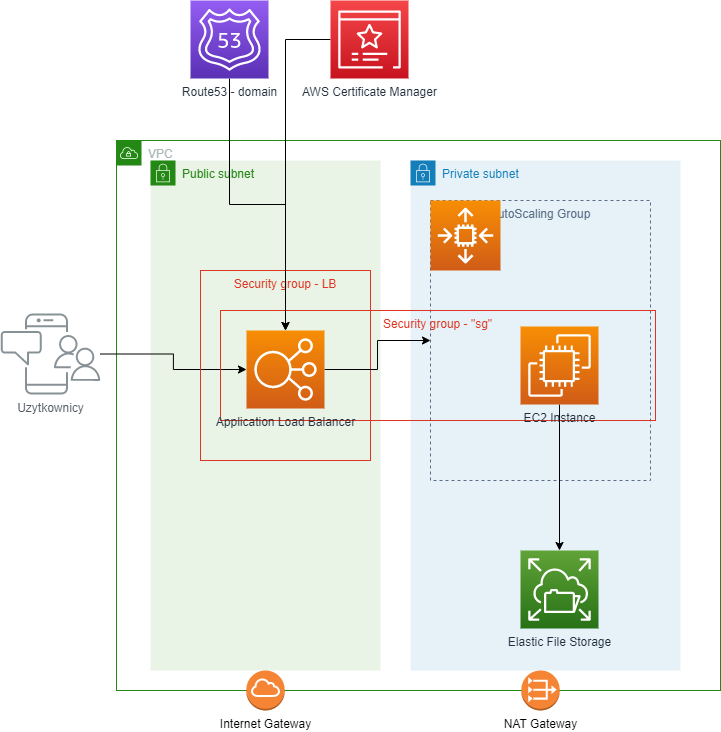

# devops-workshop-08.05.24

## Budujemy Serwer Jenkinsa

## CICD - GitHub Actions

- Utworzenie bucket'u S3 na pliki stanu terraform - 850480876735-demo-tfstate
- Utworzenie IAM Role dla GitHub Actions
  - dedykowany katalog "cicd"
  - przy pomocy terraform tworzymy:
    - IAM Role - github-actions-demo ktora bedzie miala trust relationship z GitHub i naszym repozytorium
    - OpenID Connect (OIDC) identity provider - ustawienie zaufania dla GitHub'a jako autoryzacji roli.
  - logowanie do aws - `aws sso login --profile dor11`
  - ustawienie defaultowego profilu - `export AWS_DEFAULT_PROFILE=dor11`
  - deployment `cd cicd; terraform init; terraform apply`
- Utworzenie GitHub Actions workflow
  - `cd ..; mkdir -p .github/workflows`
  - `touch .github/workflows/terraform.yml`